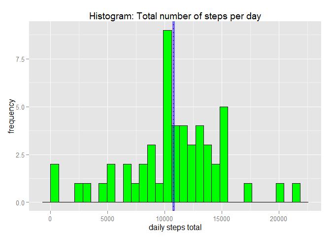
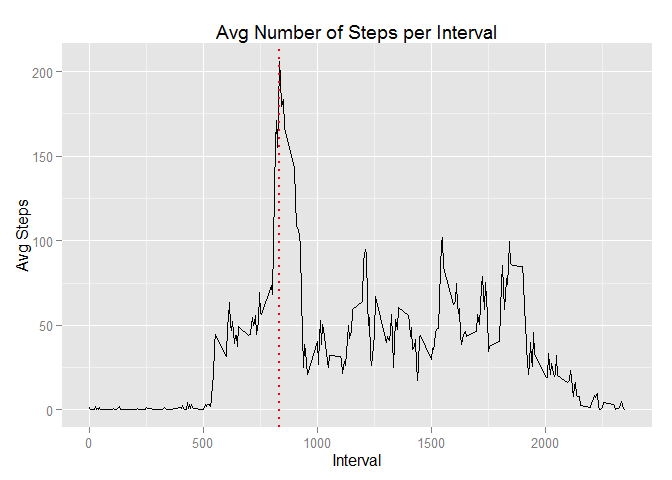
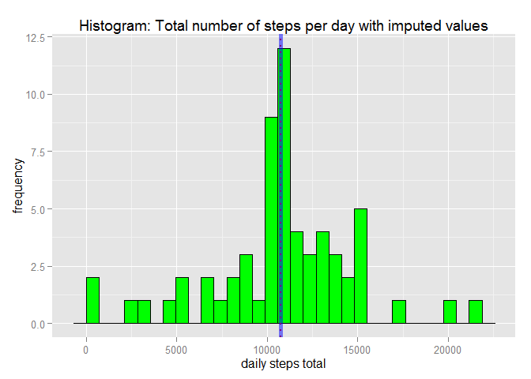
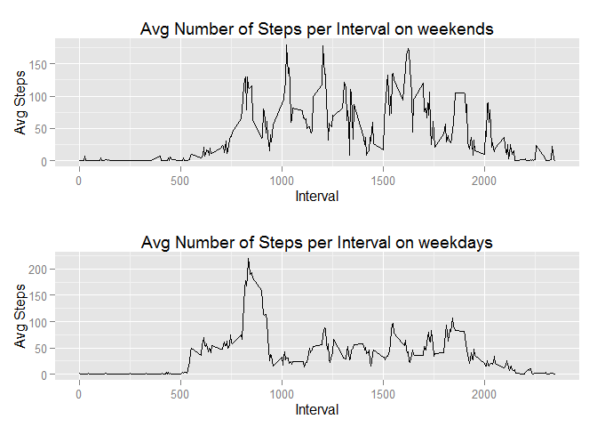

# Reproducible Research: Peer Assessment 1


## Step 1:Loading and preprocessing the data
Show any code that is needed to  
 - Load the data (i.e. read.csv())  
 - Process/transform the data (if necessary) into a format suitable for your analysis


```r
# Libraries
options(warn=-1)
library(dplyr)
```

```
## 
## Attaching package: 'dplyr'
## 
## The following object is masked from 'package:stats':
## 
##     filter
## 
## The following objects are masked from 'package:base':
## 
##     intersect, setdiff, setequal, union
```

```r
library(ggplot2)
library(gridExtra)
```

```
## Loading required package: grid
```

```r
# Preparation
path.dir <- getwd()
path.datafile <- paste0(path.dir,"/repdata-data-activity/activity.csv")
# Read Data
activity <- read.csv(path.datafile, header=TRUE, sep=",", na.strings="NA", stringsAsFactors=FALSE)
## Explore data
names(activity)
```

```
## [1] "steps"    "date"     "interval"
```

```r
# Clean Data
activity$date<-as.Date(activity$date)
# Explore Data
str(activity)
```

```
## 'data.frame':	17568 obs. of  3 variables:
##  $ steps   : int  NA NA NA NA NA NA NA NA NA NA ...
##  $ date    : Date, format: "2012-10-01" "2012-10-01" ...
##  $ interval: int  0 5 10 15 20 25 30 35 40 45 ...
```

## Step 2:What is mean total number of steps taken per day?
For this part of the assignment, you can ignore the missing values in the dataset.  
 - Calculate the total number of steps taken per day  
 - Make a histogram of the total number of steps taken each day  
 - Calculate and report the mean and median of the total number of steps taken per day

First, we remove NA from the raw data.

```r
# Remove NA
activityComplete = na.omit(activity)
```
and group the steps by date with dplyr functions

```r
# First Question: What is mean total number of steps taken per day?
# Group by date the activity data for steps calculation

activityByDate <- activityComplete %>% 
    group_by(date) %>% 
    summarise (step.total = sum(steps), step.mean = round(mean(steps)), step.median=median(steps)) 
activityByDate
```

```
## Source: local data frame [53 x 4]
## 
##          date step.total step.mean step.median
## 1  2012-10-02        126         0           0
## 2  2012-10-03      11352        39           0
## 3  2012-10-04      12116        42           0
## 4  2012-10-05      13294        46           0
## 5  2012-10-06      15420        54           0
## 6  2012-10-07      11015        38           0
## 7  2012-10-09      12811        44           0
## 8  2012-10-10       9900        34           0
## 9  2012-10-11      10304        36           0
## 10 2012-10-12      17382        60           0
## ..        ...        ...       ...         ...
```
calc mean and medain, plot the histogram

```r
# Calc mean
calcMean <- mean(activityByDate$step.total)
print((calcMean))
```

```
## [1] 10766.19
```

```r
# Calc median
calcMedian <- median(activityByDate$step.total)
print(calcMedian)
```

```
## [1] 10765
```

```r
# Plot histogram
ggplot(data=activityByDate, aes(x=step.total)) + geom_histogram(fill="green", color="black") + labs(title="Histogram: Total number of steps per day", x="daily steps total",y="frequency") + geom_vline(xintercep = calcMedian, color="red",linetype="dotted", size=1, alpha=1) + geom_vline(xintercep = calcMean, color="blue", size=2, alpha=0.5)
```

 
  
## Step 3:What is the average daily activity pattern?
With complete data   
 - Make a time series plot (i.e. type = "l") of the 5-minute interval (x-axis) and the average number of steps taken, averaged across all days (y-axis)  
 - Which 5-minute interval, on average across all the days in the dataset, contains the maximum number of steps?  
Preparing datatable for plot

```r
activtyByInterval <- activityComplete %>% group_by(interval) %>% summarise (interval.mean = mean(steps)) 
activtyByInterval
```

```
## Source: local data frame [288 x 2]
## 
##    interval interval.mean
## 1         0     1.7169811
## 2         5     0.3396226
## 3        10     0.1320755
## 4        15     0.1509434
## 5        20     0.0754717
## 6        25     2.0943396
## 7        30     0.5283019
## 8        35     0.8679245
## 9        40     0.0000000
## 10       45     1.4716981
## ..      ...           ...
```
Find 5-minute interval with maximum number of steps  

```r
findMaxNumberIndex <- which(activtyByInterval$interval.mean == max(activtyByInterval$interval.mean))
findMaxNumber <- activtyByInterval[findMaxNumberIndex,1]
print(findMaxNumber)
```

```
## Source: local data frame [1 x 1]
## 
##   interval
## 1      835
```
Show plot

```r
ggplot(data=activtyByInterval, aes(x=interval,y=interval.mean)) + geom_line() + labs(title="Avg Number of Steps per Interval",x="Interval",y="Avg Steps") + geom_vline(xintercep = as.numeric(findMaxNumber), color="red",linetype="dotted", size=1, alpha=1)
```

 
  
The red line representing the max. of avg. steps per each 5min time interval. It is the interval with signature **835**.


## Step 4:Imputing missing values

Note that there are a number of days/intervals where there are missing values (coded as NA). The presence of missing days may introduce bias into some calculations or summaries of the data.  
  
 - Calculate and report the total number of missing values in the dataset (i.e. the total number of rows with NAs)
 - Devise a strategy for filling in all of the missing values in the dataset. The strategy does not need to be sophisticated. For example, you could use the mean/median for that day, or the mean for that 5-minute interval, etc.  
 - Create a new dataset that is equal to the original dataset but with the missing data filled in.  
 - Make a histogram of the total number of steps taken each day and Calculate and report the mean and median total number of steps taken per day. Do these values differ from the estimates from the first part of the assignment? What is the impact of imputing missing data on the estimates of the total daily number of steps?  
 
 Let start with with exploring the missing values:
 

```r
incompleteRows <- nrow(activity) - sum(complete.cases(activity))
print(incompleteRows)
```

```
## [1] 2304
```

We fill the missing values with a daily mean value.

```r
# first copy the orginal data
activityImputed <- activity
# next iterate each row, select if missing step
for (i in 1:nrow(activityImputed)) {
    if(is.na(activityImputed[i,]$steps)) {
        imputedInterval <- activityImputed[i,]$interval
        signatureIndex <- which(activtyByInterval[,"interval"] == imputedInterval)
        signatureMean <- activtyByInterval[signatureIndex,]$interval.mean
        activityImputed[i,]$steps <- signatureMean
        #message(paste0("NA value in row:",i," interval:",imputedInterval, "signature:",signatureIndex),"test", signatureMean)
    }
}
# finally check data again
incompleteRowsImputed <- nrow(activityImputed) - sum(complete.cases(activityImputed))
print(incompleteRowsImputed)
```

```
## [1] 0
```
Now prepare and print the new histogram with imputed data

```r
activityByDateImputed <- activityImputed %>% 
    group_by(date) %>% 
    summarise (step.total = sum(steps), step.mean = round(mean(steps)), step.median=median(steps)) 
activityByDateImputed
```

```
## Source: local data frame [61 x 4]
## 
##          date step.total step.mean step.median
## 1  2012-10-01   10766.19        37    34.11321
## 2  2012-10-02     126.00         0     0.00000
## 3  2012-10-03   11352.00        39     0.00000
## 4  2012-10-04   12116.00        42     0.00000
## 5  2012-10-05   13294.00        46     0.00000
## 6  2012-10-06   15420.00        54     0.00000
## 7  2012-10-07   11015.00        38     0.00000
## 8  2012-10-08   10766.19        37    34.11321
## 9  2012-10-09   12811.00        44     0.00000
## 10 2012-10-10    9900.00        34     0.00000
## ..        ...        ...       ...         ...
```

```r
# Calc mean
calcMeanImputed <- mean(activityByDateImputed$step.total)
print((calcMeanImputed))
```

```
## [1] 10766.19
```

```r
# Calc median
calcMedianImputed <- median(activityByDateImputed$step.total)
print(calcMedianImputed)
```

```
## [1] 10766.19
```

```r
# start plot
ggplot(data=activityByDateImputed, aes(x=step.total)) + geom_histogram(fill="green", color="black") + labs(title="Histogram: Total number of steps per day with imputed values", x="daily steps total",y="frequency") + geom_vline(xintercep = calcMedianImputed, color="red",linetype="dotted", size=1, alpha=1) + geom_vline(xintercep = calcMeanImputed, color="blue", size=2, alpha=0.5)
```

 
   
Yes, these new values differ from the estimates frome the first part of the assigment.
Both mean and median are higher than the same metrics taken from the original data.


## Step 5: Are there differences in activity patterns between weekdays and weekends?  

For this part the weekdays() function may be of some help here. Use the dataset with the filled-in missing values for this part.

 - Create a new factor variable in the dataset with two levels - "weekday" and "weekend" indicating whether a given date is a weekday or weekend day.  
 - Make a panel plot containing a time series plot (i.e. type = "l") of the 5-minute interval (x-axis) and the average number of steps taken, averaged across all weekday days or weekend days (y-axis). See the README file in the GitHub repository to see an example of what this plot should look like using simulated data.

We can create the new columns with dplyr and the weekday() function. 

```r
# Set language to English (to correlcty display weekday abbrevations)
Sys.setenv(LANGUAGE = "en")
Sys.setlocale("LC_TIME", "English")
```

```
## [1] "English_United States.1252"
```

```r
# using mutate 
activityImputed <-mutate(activityImputed,day=weekdays(activityImputed$date), dayofweek = ifelse(weekdays(activityImputed$date)=="Sunday" |  weekdays(activityImputed$date)=="Sunday","weekend","weekday"))
activityImputed$day<-as.factor(activityImputed$day)  
activityImputed$dayofweek<-as.factor(activityImputed$dayofweek)    
summary(activityImputed)
```

```
##      steps             date               interval             day      
##  Min.   :  0.00   Min.   :2012-10-01   Min.   :   0.0   Friday   :2592  
##  1st Qu.:  0.00   1st Qu.:2012-10-16   1st Qu.: 588.8   Monday   :2592  
##  Median :  0.00   Median :2012-10-31   Median :1177.5   Saturday :2304  
##  Mean   : 37.38   Mean   :2012-10-31   Mean   :1177.5   Sunday   :2304  
##  3rd Qu.: 27.00   3rd Qu.:2012-11-15   3rd Qu.:1766.2   Thursday :2592  
##  Max.   :806.00   Max.   :2012-11-30   Max.   :2355.0   Tuesday  :2592  
##                                                         Wednesday:2592  
##    dayofweek    
##  weekday:15264  
##  weekend: 2304  
##                 
##                 
##                 
##                 
## 
```
Now we prepare and show the new plot

```r
# Group the new data by dayofweek and get avg steps number
activityImputedByDayOfWeek <- activityImputed %>% group_by(interval, dayofweek) %>% 
    summarise(interval.mean = mean(steps))

# Filter data
aI.filterWE <- filter(activityImputedByDayOfWeek,dayofweek=="weekend")
aI.filterWD <- filter(activityImputedByDayOfWeek,dayofweek=="weekday")

# Plot the plot
p1 <- ggplot(data=aI.filterWE, aes(x=interval,y=interval.mean)) + geom_line() + labs(title="Avg Number of Steps per Interval on weekends",x="Interval",y="Avg Steps")
p2 <- ggplot(data=aI.filterWD, aes(x=interval,y=interval.mean)) + geom_line() + labs(title="Avg Number of Steps per Interval on weekdays",x="Interval",y="Avg Steps")

#Show both in grid
grid.arrange(p1,p2)
```

 
  
**Conclusion**
We can observe that there is a difference in the acitivity patterns between weekdays and weekends.  
The whole weekend days seem to be of higher intensity than weekdays.
